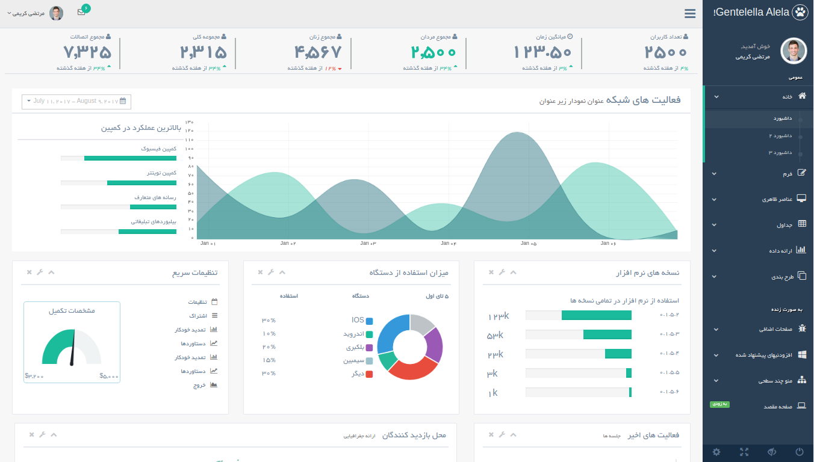

<div dir="rtl" align="right">

Gentelella Alela! - مستندات



-   [فایل‌ها و پوشه‌ها](#فایل‌ها-و-پوشه‌ها)
-   [لایه‌ها و ساختار](#قالب-و-ساختار)
-   [اعتبارات](#اعتبارات)

معرفی
============

به **Gentelella** خوش آمدید. یک پنل مدیریت کامل و فلت راست‌چین شده بر اساس قالب اصلی [Gentelella](https://github.com/puikinsh/gentelella).
این قالب بر اساس بوت‌استرپ ۳ طراحی گشته و با استفاده از روش‌های مدرن طراحی آمده به خدمت گرفته شدن در پروژه‌های شما در هر اندازه‌ای می‌باشد.


**[دموی قالب را مشاهده نمایید](https://mortezakarimi.github.io/gentelella-rtl/public/index.html)**

محدوده اطلاعات ارائه شده در این مستندات
-------------------
در این مستندات فقط به ساختار کلی فایل‌ها و پوشه‌ها و همچنین ساختار قالب پرداخته می‌شود و در بقیه موارد شما می‌توانید با استفاده از سیستم‌های آنالیز کد مانند **Chrome Inspect** به اطلاعات بیشتری از ساختار دست پیدا کنید.

قالب موجود بر اساس  بوت‌استرپ ۳ بنا شده است و شما می‌توانید از اطلاعات موجود در آدرس زیر استفاده نمایید. 

[http://getbootstrap.com/css/](http://getbootstrap.com/css/)

شروع موارد
---------------

با استفاده از صفحه  `plain_page.html` می‌توانید قالب خام و کلی را داشته باشید و سپس قطعات مورد نیاز خود را بیافزایید.


#### نصب با استفاده از مدیریت بسته ها

هدف من این است که این پکیج با استفاده از تمام مدیرت بسته های مختلف قابل نصب باشد. در صورتی که مدیریت بسته مورد نظر شما در زیر وجود ندارد کافیست Pull Request دهید

چند روش نصب این بسته در زیر آمده است:

**دانلود آخرین نسخه از گیت هاب**

همچنین برای دانلود آخرین نسخه میتوانید از این پیوند اقدام نمایید.

[دانلود](https://github.com/mortezakarimi/gentelella-rtl/releases/latest)


**نصب با استفاده از گیت هاب**

<div dir="LTR" align="left" style="direction:ltr;text-align:left;">

```
git clone https://github.com/mortezakarimi/gentelella-rtl.git -b 'gh-pages'
```


**Bower**

```
bower install gentelella-rtl --save
```

**npm**

```
npm install gentelella-rtl --save
```

</div>

فایل‌ها و پوشه‌ها
---------------------

<div dir="LTR" align="left" style="direction:ltr;text-align:left;">

```text
Root
├── build
│   ├── css
│   │   ├── maps
│   │   │   └── jquery-jvectormap-2.0.3.css
│   │   ├── custom.css
│   │   ├── custom.css.map
│   │   ├── custom.min.css
│   │   ├── daterangepicker.css
│   │   ├── daterangepicker.css.map
│   │   └── daterangepicker.min.css
│   ├── fonts
│   │   ├── B_Yekan.eot
│   │   ├── B_Yekan.svg
│   │   ├── B_Yekan.ttf
│   │   ├── B_Yekan.woff
│   │   ├── DroidKufi-Regular.eot
│   │   ├── DroidKufi-Regular.ttf
│   │   ├── DroidKufi-Regular.woff
│   │   ├── DroidKufi-Regular.woff2
│   │   ├── FontAweasome.otf
│   │   ├── FontAwesome.otf
│   │   ├── fontawesome-webfont.eot
│   │   ├── fontawesome-webfont.svg
│   │   ├── fontawesome-webfont.ttf
│   │   ├── fontawesome-webfont.woff
│   │   ├── fontawesome-webfont.woff2
│   │   ├── openSans-400.woff2
│   │   ├── openSans-600.woff2
│   │   ├── openSans-700.woff2
│   │   ├── Yekan-modified.eot
│   │   ├── Yekan-modified.ttf
│   │   └── Yekan-modified.woff
│   ├── images
│   │   ├── american-express.png
│   │   ├── cropper.jpg
│   │   ├── favicon.ico
│   │   ├── img.jpg
│   │   ├── inbox.png
│   │   ├── mastercard.png
│   │   ├── media.jpg
│   │   ├── paypal.png
│   │   ├── picture.jpg
│   │   ├── prod-1.jpg
│   │   ├── prod-2.jpg
│   │   ├── prod-3.jpg
│   │   ├── prod-4.jpg
│   │   ├── prod-5.jpg
│   │   ├── user.png
│   │   └── visa.png
│   └── js
│       ├── datepicker
│       │   └── daterangepicker.js
│       ├── helpers
│       │   └── smartresize.js
│       ├── moment
│       │   └── moment.min.js
│       ├── custom.js
│       └── custom.min.js
├── documentation
│   ├── images
│   │   ├── demo-template.png
│   │   ├── layout.png
│   │   ├── min_menu.png
│   │   ├── min_menu.tiff
│   │   ├── welcome.png
│   │   └── welcome.tiff
│   ├── plain_page.html
│   └── index.md
├── production
│   ├── calendar.html
│   ├── chartjs2.html
│   ├── chartjs.html
│   ├── contacts.html
│   ├── echarts.html
│   ├── e_commerce.html
│   ├── fixed_footer.html
│   ├── fixed_sidebar.html
│   ├── form_advanced.html
│   ├── form_buttons.html
│   ├── form.html
│   ├── form_upload.html
│   ├── form_validation.html
│   ├── form_wizards.html
│   ├── general_elements.html
│   ├── glyphicons.html
│   ├── icons.html
│   ├── inbox.html
│   ├── index2.html
│   ├── index3.html
│   ├── index.html
│   ├── invoice.html
│   ├── layout.html
│   ├── level2.html
│   ├── login.html
│   ├── media_gallery.html
│   ├── morisjs.html
│   ├── other_charts.html
│   ├── page_403.html
│   ├── page_404.html
│   ├── page_500.html
│   ├── plain_page.html
│   ├── pricing_tables.html
│   ├── profile.html
│   ├── project_detail.html
│   ├── projects.html
│   ├── tables_dynamic.html
│   ├── tables.html
│   ├── typography.html
│   ├── widgets.html
├── src
│   ├── js
│   │   ├── helpers
│   │   │   └── smartresize.js
│   │   └── custom.js
│   └── scss
│       ├── partials
│       │   ├── _extends.scss
│       │   ├── _grid.scss
│       │   ├── _utilis.scss
│       │   └── _variables.scss
│       ├── custom.scss
│       └── daterangepicker.scss
├── bower.json
├── changelog.md
├── config.rb
├── gulpfile.js
├── ISSUE_TEMPLATE.md
├── LICENSE.txt
├── package.json
├── README-EN.md
└── README.md

17 directories, 115 files
```

</div>

ساختار فایل‌ها و پوشه‌های پروژه به صورت بالا می‌باشد ک در این ساختار پوشه  `vendors`  که وظیفه نگهداری فایل‌های مورد نیاز در پروژه را دارد نمایش داده نشده همچنین پس از اجرا پوشه `public` تولید می‌شود که فایل‌های کامپایل شده پروژه که مناسب استفاده در حالت تولید پروژه می‌باشد را شامل می‌شود.

قالب و ساختار
--------------------

-   [هدر](#هدر)
-   [منو بالا](#منو-بالا)
-   [منو کناری](#منو-کناری)
-   [محتوی](#محتوی)
-   [فوتر](#فوتر)

#### هدر

کد لازم برای بخش هدر به صورت زیر می‌باشد.

<div dir="LTR" align="left" style="direction:ltr;text-align:left;">

```html
<!DOCTYPE html>
<html lang="fa" dir="rtl">
<head>
    <meta http-equiv="Content-Type" content="text/html; charset=UTF-8">
    <!-- Meta, title, CSS, favicons, etc. -->
    <meta charset="utf-8">
    <meta http-equiv="X-UA-Compatible" content="IE=edge">
    <meta name="viewport" content="width=device-width, initial-scale=1">
    <link rel="icon" href="../build/images/favicon.ico" type="image/ico"/>
    <title>Gentelella Alela! | قالب مدیریت رایگان </title>

    <!-- Bootstrap -->
    <link href="../vendors/bootstrap/dist/css/bootstrap.min.css" rel="stylesheet">
    <link href="../vendors/bootstrap-rtl/dist/css/bootstrap-rtl.min.css" rel="stylesheet">
    <!-- Font Awesome -->
    <link href="../vendors/font-awesome/css/font-awesome.min.css" rel="stylesheet">
    <!-- NProgress -->
    <link href="../vendors/nprogress/nprogress.css" rel="stylesheet">
    <!-- bootstrap-progressbar -->
    <link href="../vendors/bootstrap-progressbar/css/bootstrap-progressbar-3.3.4.min.css" rel="stylesheet">
    <!-- iCheck -->
    <link href="../vendors/iCheck/skins/flat/green.css" rel="stylesheet">
    <!-- bootstrap-daterangepicker -->
    <link href="../vendors/bootstrap-daterangepicker/daterangepicker.css" rel="stylesheet">
    
    <!-- Add page needed styles here -->
    
    <!-- End page needed styles here -->
    
    
    <!-- Custom Theme Style -->
    <link href="../build/css/custom.min.css" rel="stylesheet">
</head>                 
```

#### منو بالا

کد لازم برای منو بالا به صورت زیر می‌باشد.

```html
<!-- top navigation -->
        <div class="top_nav hidden-print">
            <div class="nav_menu">
                <nav>
                    <div class="nav toggle">
                        <a id="menu_toggle"><i class="fa fa-bars"></i></a>
                    </div>

                    <ul class="nav navbar-nav navbar-right">
                        <li class="">
                            <a href="javascript:;" class="user-profile dropdown-toggle" data-toggle="dropdown"
                               aria-expanded="false">
                                مرتضی کریمی
                                <span class=" fa fa-angle-down"></span>
                            </a>
                            <ul class="dropdown-menu dropdown-usermenu pull-right">
                                <li><a href="javascript:;"> نمایه</a></li>
                                <li>
                                    <a href="javascript:;">
                                        <span class="badge bg-red pull-right">50%</span>
                                        <span>تنظیمات</span>
                                    </a>
                                </li>
                                <li><a href="javascript:;">کمک</a></li>
                                <li><a href="login.html"><i class="fa fa-sign-out pull-right"></i> خروج</a></li>
                            </ul>
                        </li>

                        <li role="presentation" class="dropdown">
                            <a href="javascript:;" class="dropdown-toggle info-number" data-toggle="dropdown"
                               aria-expanded="false">
                                <i class="fa fa-envelope-o"></i>
                                <span class="badge bg-green">6</span>
                            </a>
                            <ul id="menu1" class="dropdown-menu list-unstyled msg_list" role="menu">
                                <li>
                                    <a>
                                        <span class="image"></span>
                                        <span>
                          <span>مرتضی کریمی</span>
                          <span class="time">3 دقیقه پیش</span>
                        </span>
                                        <span class="message">
                          فیلمای فستیوال فیلمایی که اجرا شده یا راجع به لحظات مرده ایه که فیلمسازا میسازن. آنها جایی بودند که....
                        </span>
                                    </a>
                                </li>
                                <li>
                                    <a>
                                        <span class="image"></span>
                                        <span>
                          <span>مرتضی کریمی</span>
                          <span class="time">3 دقیقه پیش</span>
                        </span>
                                        <span class="message">
                          فیلمای فستیوال فیلمایی که اجرا شده یا راجع به لحظات مرده ایه که فیلمسازا میسازن. آنها جایی بودند که....
                        </span>
                                    </a>
                                </li>
                                <li>
                                    <a>
                                        <span class="image"></span>
                                        <span>
                          <span>مرتضی کریمی</span>
                          <span class="time">3 دقیقه پیش</span>
                        </span>
                                        <span class="message">
                          فیلمای فستیوال فیلمایی که اجرا شده یا راجع به لحظات مرده ایه که فیلمسازا میسازن. آنها جایی بودند که....
                        </span>
                                    </a>
                                </li>
                                <li>
                                    <a>
                                        <span class="image"></span>
                                        <span>
                          <span>مرتضی کریمی</span>
                          <span class="time">3 دقیقه پیش</span>
                        </span>
                                        <span class="message">
                          فیلمای فستیوال فیلمایی که اجرا شده یا راجع به لحظات مرده ایه که فیلمسازا میسازن. آنها جایی بودند که....
                        </span>
                                    </a>
                                </li>
                                <li>
                                    <div class="text-center">
                                        <a>
                                            <strong>مشاهده تمام اعلان ها</strong>
                                            <i class="fa fa-angle-right"></i>
                                        </a>
                                    </div>
                                </li>
                            </ul>
                        </li>
                    </ul>
                </nav>
            </div>
        </div>
        <!-- /top navigation -->
```

</div>

#### هدر

کد لازم برای بخش منو کناری به صورت زیر می‌باشد.

<div dir="LTR" align="left" style="direction:ltr;text-align:left;">

```html
<div class="col-md-3 left_col hidden-print">
    <div class="left_col scroll-view">
        <div class="navbar nav_title" style="border: 0;">
            <a href="index.html" class="site_title"><i class="fa fa-paw"></i> <span>Gentelella Alela!</span></a>
        </div>

        <div class="clearfix"></div>

        <!-- menu profile quick info -->
        <div class="profile clearfix">
            <div class="profile_pic">
                
            </div>
            <div class="profile_info">
                <span>خوش آمدید,</span>
                <h2>مرتضی کریمی</h2>
            </div>
        </div>
        <!-- /menu profile quick info -->

        <br/>

        <!-- sidebar menu -->
        <div id="sidebar-menu" class="main_menu_side hidden-print main_menu">
            <div class="menu_section">
                <h3>عمومی</h3>
                <ul class="nav side-menu">
                    <li><a><i class="fa fa-home"></i> خانه <span class="fa fa-chevron-down"></span></a>
                        <ul class="nav child_menu">
                            <li><a href="index.html">داشبورد</a></li>
                            <li><a href="index2.html">داشبورد ۲</a></li>
                            <li><a href="index3.html">داشبورد ۳</a></li>
                        </ul>
                    </li>
                    <li><a><i class="fa fa-edit"></i> فرم <span class="fa fa-chevron-down"></span></a>
                        <ul class="nav child_menu">
                            <li><a href="form.html">فرم عمومی</a></li>
                            <li><a href="form_advanced.html">قطعات پیشرفته</a></li>
                            <li><a href="form_validation.html">فرم اعتبار سنجی</a></li>
                            <li><a href="form_wizards.html">فرم جادوگر</a></li>
                            <li><a href="form_upload.html">فرم بارگذاری</a></li>
                            <li><a href="form_buttons.html">فرم کلید ها</a></li>
                        </ul>
                    </li>
                    <li><a><i class="fa fa-desktop"></i> عناصر ظاهری <span
                            class="fa fa-chevron-down"></span></a>
                        <ul class="nav child_menu">
                            <li><a href="general_elements.html">عناصر عمومی</a></li>
                            <li><a href="media_gallery.html">گالری چندرسانه ای</a></li>
                            <li><a href="typography.html">تایپو گرافی</a></li>
                            <li><a href="icons.html">آیکون ها</a></li>
                            <li><a href="glyphicons.html">Glyphicons</a></li>
                            <li><a href="widgets.html">ابزارک</a></li>
                            <li><a href="invoice.html">صورت حساب</a></li>
                            <li><a href="inbox.html">صندوق</a></li>
                            <li><a href="calendar.html">تقویم</a></li>
                        </ul>
                    </li>
                    <li><a><i class="fa fa-table"></i> جداول <span class="fa fa-chevron-down"></span></a>
                        <ul class="nav child_menu">
                            <li><a href="tables.html">جداول</a></li>
                            <li><a href="tables_dynamic.html">جدول پویا</a></li>
                        </ul>
                    </li>
                    <li><a><i class="fa fa-bar-chart-o"></i> ارائه داده <span class="fa fa-chevron-down"></span></a>
                        <ul class="nav child_menu">
                            <li><a href="chartjs.html">Chart JS</a></li>
                            <li><a href="chartjs2.html">Chart JS2</a></li>
                            <li><a href="morisjs.html">Moris JS</a></li>
                            <li><a href="echarts.html">ECharts</a></li>
                            <li><a href="other_charts.html">چارت های دیگر</a></li>
                        </ul>
                    </li>
                    <li><a><i class="fa fa-clone"></i>طرح بندی <span class="fa fa-chevron-down"></span></a>
                        <ul class="nav child_menu">
                            <li><a href="fixed_sidebar.html">نوار کناری ثابت</a></li>
                            <li><a href="fixed_footer.html">پاورقی ثابت</a></li>
                        </ul>
                    </li>
                </ul>
            </div>
            <div class="menu_section">
                <h3>به صورت زنده</h3>
                <ul class="nav side-menu">
                    <li><a><i class="fa fa-bug"></i> صفحات اضافی <span class="fa fa-chevron-down"></span></a>
                        <ul class="nav child_menu">
                            <li><a href="e_commerce.html">تجارت الکترونیک</a></li>
                            <li><a href="projects.html">پروژه ها</a></li>
                            <li><a href="project_detail.html">جزئیات پروژه</a></li>
                            <li><a href="contacts.html">اطلاعات تماس</a></li>
                            <li><a href="profile.html">نمایه</a></li>
                        </ul>
                    </li>
                    <li><a><i class="fa fa-windows"></i> افزودنیهای پیشنهاد شده <span
                            class="fa fa-chevron-down"></span></a>
                        <ul class="nav child_menu">
                            <li><a href="page_403.html">403 ارور</a></li>
                            <li><a href="page_404.html">404 ارور</a></li>
                            <li><a href="page_500.html">500 ارور</a></li>
                            <li><a href="plain_page.html">صفحه ساده</a></li>
                            <li><a href="login.html">صفحه ورود</a></li>
                            <li><a href="pricing_tables.html">جداول قیمت</a></li>
                        </ul>
                    </li>
                    <li><a><i class="fa fa-sitemap"></i> منو چند سطحی <span
                            class="fa fa-chevron-down"></span></a>
                        <ul class="nav child_menu">
                            <li><a href="#level1_1">سطح یک</a>
                            <li><a>سطح یک<span class="fa fa-chevron-down"></span></a>
                                <ul class="nav child_menu">
                                    <li class="sub_menu"><a href="level2.html">سطح دو</a>
                                    </li>
                                    <li><a href="#level2_1">سطح دو</a>
                                    </li>
                                    <li><a href="#level2_2">سطح دو</a>
                                    </li>
                                </ul>
                            </li>
                            <li><a href="#level1_2">سطح یک</a>
                            </li>
                        </ul>
                    </li>
                    <li><a href="javascript:void(0)"><i class="fa fa-laptop"></i> صفحه مقصد <span
                            class="label label-success pull-left">به زودی</span></a></li>
                </ul>
            </div>

        </div>
        <!-- /sidebar menu -->

        <!-- /menu footer buttons -->
        <div class="sidebar-footer hidden-small">
            <a data-toggle="tooltip" data-placement="top" title="تنظیمات">
                <span class="glyphicon glyphicon-cog" aria-hidden="true"></span>
            </a>
            <a data-toggle="tooltip" data-placement="top" title="تمام صفحه" onclick="toggleFullScreen();">
                <span class="glyphicon glyphicon-fullscreen" aria-hidden="true"></span>
            </a>
            <a data-toggle="tooltip" data-placement="top" title="قفل" class="lock_btn">
                <span class="glyphicon glyphicon-eye-close" aria-hidden="true"></span>
            </a>
            <a data-toggle="tooltip" data-placement="top" title="خروج" href="login.html">
                <span class="glyphicon glyphicon-off" aria-hidden="true"></span>
            </a>
        </div>
        <!-- /menu footer buttons -->
    </div>
</div>                 
```

</div>

#### محتوی

با استفاده از کد زیر می‌توانید یک صفحه ساده را با استفاده از بخش‌های دیگر ایجاد نمایید.

<div dir="LTR" align="left" style="direction:ltr;text-align:left;">

```html
<!-- page content -->
<div class="right_col" role="main">
    <div class="">
        <div class="page-title">
            <div class="title_left">
                <h3>صفحه ساده</h3>
            </div>

            <div class="title_right">
                <div class="col-md-5 col-sm-5 col-xs-12 form-group pull-right top_search">
                    <div class="input-group">
                        <input type="text" class="form-control" placeholder="جست و جو برای...">
                        <span class="input-group-btn">
                      <button class="btn btn-default" type="button">برو!</button>
                    </span>
                    </div>
                </div>
            </div>
        </div>

        <div class="clearfix"></div>

        <div class="row">
            <div class="col-md-12 col-sm-12 col-xs-12">
                <div class="x_panel">
                    <div class="x_title">
                        <h2>صفحه ساده</h2>
                        <ul class="nav navbar-right panel_toolbox">
                            <li><a class="collapse-link"><i class="fa fa-chevron-up"></i></a>
                            </li>
                            <li class="dropdown">
                                <a href="#" class="dropdown-toggle" data-toggle="dropdown" role="button"
                                   aria-expanded="false"><i class="fa fa-wrench"></i></a>
                                <ul class="dropdown-menu" role="menu">
                                    <li><a href="#">تنظیمات 1</a>
                                    </li>
                                    <li><a href="#">تنظیمات 2</a>
                                    </li>
                                </ul>
                            </li>
                            <li><a class="close-link"><i class="fa fa-close"></i></a>
                            </li>
                        </ul>
                        <div class="clearfix"></div>
                    </div>
                    <div class="x_content">
                        افزودن محتوا با این صفحه ...
                    </div>
                </div>
            </div>
        </div>
    </div>
</div>
<!-- /page content -->
```

</div>

#### فوتر

<div dir="LTR" align="left" style="direction:ltr;text-align:left;">

```html
<!-- footer content -->
        <footer class="hidden-print">
            <div class="pull-left">
                Gentelella - قالب پنل مدیریت بوت استرپ <a href="https://colorlib.com">Colorlib</a> | پارسی شده توسط <a
                    href="https://morteza-karimi.ir">مرتضی کریمی</a>
            </div>
            <div class="clearfix"></div>
        </footer>
        <!-- /footer content -->
    </div>
</div>
<div id="lock_screen">
    <table>
        <tr>
            <td>
                <div class="clock"></div>
                <span class="unlock">
                    <span class="fa-stack fa-5x">
                      <i class="fa fa-square-o fa-stack-2x fa-inverse"></i>
                      <i id="icon_lock" class="fa fa-lock fa-stack-1x fa-inverse"></i>
                    </span>
                </span>
            </td>
        </tr>
    </table>
</div>
<!-- jQuery -->
<script src="../vendors/jquery/dist/jquery.min.js"></script>
<!-- Bootstrap -->
<script src="../vendors/bootstrap/dist/js/bootstrap.min.js"></script>
<!-- FastClick -->
<script src="../vendors/fastclick/lib/fastclick.js"></script>
<!-- NProgress -->
<script src="../vendors/nprogress/nprogress.js"></script>
<!-- bootstrap-progressbar -->
<script src="../vendors/bootstrap-progressbar/bootstrap-progressbar.min.js"></script>
<!-- iCheck -->
<script src="../vendors/iCheck/icheck.min.js"></script>

<!-- bootstrap-daterangepicker -->
<script src="../vendors/moment/min/moment.min.js"></script>

<script src="../vendors/bootstrap-daterangepicker/daterangepicker.js"></script>
<!-- Add Page Scripts -->

<!-- End Page Scripts -->

<!-- Custom Theme Scripts -->
<script src="../build/js/custom.min.js"></script>
</body>
</html>
```

</div>

در انتها شما می‌توایند صفحه کامل کد را در [این](./plain_page.html) آدرس مشاهده نمایید.

اعتبارات
------------------

|Name|URL|
|----|---|
|jQuery|[http://jquery.com/](http://jquery.com/)|
|jQuery Sparkline|[http://omnipotent.net/jquery.sparkline/](http://omnipotent.net/jquery.sparkline/)|
|Auto resize textarea|[http://www.jacklmoore.com/autosize/](http://www.jacklmoore.com/autosize/)|
|C3 charts|[http://c3js.org/](http://c3js.org/)|
|Full screen editor|[http://burakson.github.io/fseditor/](http://burakson.github.io/fseditor/)|
|jQuery Tags Input|[https://github.com/xoxco/jQuery-Tags-Input](https://github.com/xoxco/jQuery-Tags-Input)|
|jQuery Validation Plugin|[http://parsleyjs.org/](http://parsleyjs.org/)|
|Colorpicker for Bootstrap|[https://github.com/xaguilars/bootstrap-colorpicker](https://github.com/xaguilars/bootstrap-colorpicker)|
|bootstrap-daterangepicker|[https://github.com/dangrossman/bootstrap-daterangepicker](https://github.com/dangrossman/bootstrap-daterangepicker)|
|bootstrap-fileupload|[http://blueimp.github.io/jQuery-File-Upload/](http://blueimp.github.io/jQuery-File-Upload/)|
|bootstrap-multiselect|[https://github.com/davidstutz/bootstrap-multiselect](https://github.com/davidstutz/bootstrap-multiselect)|
|bootstrap-wysihtml5|[http://jhollingworth.github.io/bootstrap-wysihtml5/](http://jhollingworth.github.io/bootstrap-wysihtml5/)
|Dropzone|[http://www.dropzonejs.com/](http://www.dropzonejs.com/)|
|Bootstrap switch|[https://github.com/nostalgiaz/bootstrap-switch](https://github.com/nostalgiaz/bootstrap-switch)|
|SwitcheryJs|[http://abpetkov.github.io/switchery/](http://abpetkov.github.io/switchery/)|
|DataTables|[https://github.com/DataTables/DataTables](https://github.com/DataTables/DataTables)|
|DataTables tools|[https://github.com/DataTables/TableTools](https://github.com/DataTables/TableTools)|
|easy pie chart|[https://github.com/rendro/easy-pie-chart](https://github.com/rendro/easy-pie-chart)|
|FullCalendar|[https://github.com/arshaw/fullcalendar](https://github.com/arshaw/fullcalendar)|
|jQuery Knob|[https://github.com/aterrien/jQuery-Knob](https://github.com/aterrien/jQuery-Knob)|
|select2|[https://github.com/ivaynberg/select2/](https://github.com/ivaynberg/select2/)|
|jQuery-Autocomplete|[https://github.com/devbridge/jQuery-Autocomplete](https://github.com/devbridge/jQuery-Autocomplete)|
|Twitter Bootstrap Wizard|[https://github.com/VinceG/twitter-bootstrap-wizard](https://github.com/VinceG/twitter-bootstrap-wizard)|
|E-Charts|[http://echarts.baidu.com/doc/example-en.html](http://echarts.baidu.com/doc/example-en.html)|
|Font Awesome|[http://fortawesome.github.io/Font-Awesome/](http://fortawesome.github.io/Font-Awesome/)|


#### قالب Gentelella برای دیگر فریمورک ها

<div dir="LTR" align="left" style="direction:ltr;text-align:left;">
  
* [Gentelella-rtl on Yii framework 2](https://github.com/mortezakarimi/yii2-gentelella-rtl) with an asset bundle, a layout template and some widgets. inspired from [Gentelella on Yii framework 2](https://github.com/yiister/yii2-gentelella)
* [Gentelella on Ruby on Rails 4](https://github.com/iogbole/gentelella_on_rails) thanks to Israel Ogbole.
* [Gentelella on Smarty 3](https://github.com/microvb/otp-thing) with one time password generator, validator, and QR code generator that has no web dependencies (self-contained) in PHP thanks to MicroVB INC
* [Gentelella integrated into Symfony 3](https://github.com/krzysiekpiasecki/Gentelella) full stack PHP framework thanks to Krzysztof Piasecki.
* [Gentelella on Yii framework 2](https://github.com/yiister/yii2-gentelella) with an asset bundle, a layout template and some widgets.
* [Gentelella on Angular 2](https://github.com/kmkatsma/angular2-webpack-starter-gentelella) Angular Webpack Starter modified to utilize the Gentelella.
* [Gentelella on Aurelia](https://github.com/kmkatsma/aurelia-gentelella) Typescript webpack skeleton modified to utilize the Gentelella.
</div>

به ما اطلاع دهید اگر ادغام را برای این قالب مدیریت در سایر سیستم عامل ها و چارچوب ها انجام داده اید و خوشحال خواهیم شد که کار خود را به اشتراک بگذارید.

</div>